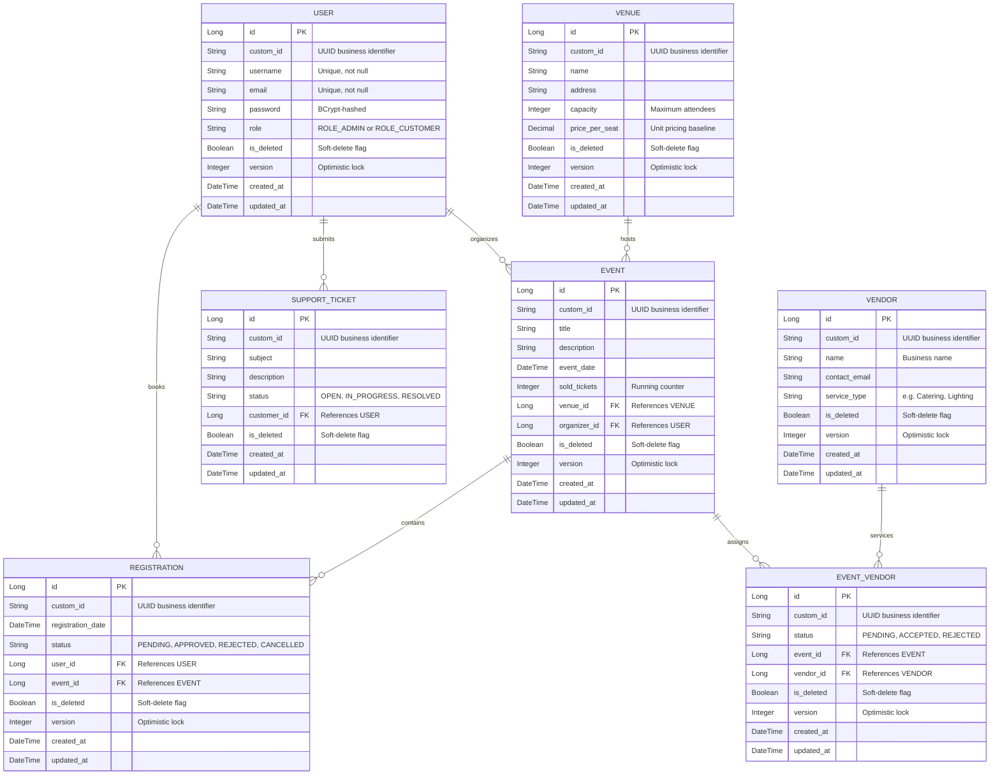

# EventZen — Database Design and Entity-Relationship Diagram

## 1. Introduction

The EventZen data layer is built on a **MySQL 8.0 relational database** shared across both the Spring Boot core service and the Node.js support microservice. The schema is designed around several key principles:

- **Normalized Relational Design** — Entities are modeled in third normal form (3NF) to eliminate data redundancy while maintaining clear referential integrity through foreign key constraints.
- **Polymorphic Superclass Auditing** — All JPA-managed entities inherit from a shared `BaseEntity` (`@MappedSuperclass`) that provides standardized audit metadata — including creation timestamps, modification timestamps, version counters, custom business identifiers, and soft-delete flags — without requiring repetitive column definitions across individual tables.
- **Soft Deletion** — No records are physically removed from the database. All deletion operations set an `is_deleted` flag, preserving complete historical data for audit trails and enabling administrative recovery of accidentally deleted records.
- **Optimistic Concurrency Control** — A `version` column on transactional entities enables JPA's `@Version`-based optimistic locking, preventing data corruption from concurrent write operations.

---

## 2. Entity-Relationship Diagram

The following diagram illustrates the core relational structure of the EventZen database. Relationship cardinalities are annotated using standard Crow's Foot notation.

---

## 3. Entity Descriptions

### 3.1 USER

The `USER` entity represents all authenticated individuals in the system. A single-column `role` discriminator distinguishes between Administrators and Customers. The system enforces uniqueness constraints on both `username` and `email` to prevent duplicate registrations. Passwords are stored as BCrypt-hashed values.

### 3.2 VENUE

Venues are the physical locations where events are hosted. Each venue defines a `capacity` (the maximum number of attendees) and a `price_per_seat` (the unit cost used to calculate booking totals). Venue records are exclusively managed by administrators.

### 3.3 EVENT

Events are the central transactional entity, linking an organizer (`USER`), a hosting location (`VENUE`), and optionally one or more service providers (`VENDOR`) through the `EVENT_VENDOR` join table. The `sold_tickets` field maintains a running count of approved bookings, enabling real-time capacity calculations against the associated venue's total capacity.

### 3.4 VENDOR

Vendors represent external service providers (caterers, lighting technicians, decorators, etc.) who can be assigned to events. Referential integrity guards prevent deletion of vendors actively assigned to events.

### 3.5 REGISTRATION

The `REGISTRATION` entity models a customer's booking for a specific event. Registrations progress through a defined status lifecycle:

| Status     | Description                                                |
| :--------- | :--------------------------------------------------------- |
| `PENDING`  | Booking submitted, awaiting administrator review           |
| `APPROVED` | Administrator confirmed; seat inventory decremented        |
| `REJECTED` | Administrator declined; seat inventory restored            |
| `CANCELLED`| Customer withdrew; seat inventory restored (if previously approved) |

### 3.6 SUPPORT_TICKET

Support tickets are the sole entity managed by the Node.js microservice. They follow a simple lifecycle (`OPEN` → `IN_PROGRESS` → `RESOLVED`) and support soft deletion with administrative restore capability.

### 3.7 EVENT_VENDOR (Join Entity)

The `EVENT_VENDOR` table resolves the many-to-many relationship between events and vendors. Each record carries an independent `status` field (`PENDING`, `ACCEPTED`, `REJECTED`) that models the real-world vendor confirmation workflow. A Spring `@Scheduled` task periodically processes pending assignments to simulate automated vendor acceptance.

---

## 4. Design Rationale

### 4.1 Why Polymorphic Superclass Auditing?

Rather than manually adding audit columns (`created_at`, `updated_at`, `version`, `is_deleted`, `custom_id`) to each entity, EventZen uses JPA's `@MappedSuperclass` annotation on a shared `BaseEntity`. This approach provides:

- **Consistency** — Every entity automatically receives identical audit infrastructure.
- **Maintainability** — Changes to the audit schema are made in a single location.
- **Compliance Readiness** — All data mutations are timestamped and version-tracked, supporting audit and regulatory requirements.

### 4.2 Why Soft Deletion?

Soft deletion preserves historical data integrity. In an event management context, this is critical for:

- **Financial Auditing** — Cancelled or rejected bookings remain in the database with their full context, supporting financial reconciliation.
- **Accidental Recovery** — Administrators can restore accidentally deleted venues, vendors, or support tickets through dedicated `/restore` endpoints.
- **Referential Safety** — Soft deletion prevents orphaned foreign key references that would occur with physical deletion.

### 4.3 Why Optimistic Locking?

The `@Version` column enables JPA's optimistic concurrency control on transactional entities. In a high-demand booking scenario, multiple customers may attempt to reserve seats for the same event simultaneously. Optimistic locking detects conflicting concurrent writes and prevents double-booking without the performance overhead of pessimistic database locks.
