# EventZen — Executive Summary

## 1. Project Overview

**EventZen** is a full-stack enterprise event management platform designed to streamline the end-to-end lifecycle of venue logistics, event orchestration, ticket booking, and customer support. The system serves two distinct user personas — **Administrators** who manage operational infrastructure and **Customers** who discover, book, and attend events — through dedicated, role-secured portals.

The platform demonstrates professional-grade software engineering practices, including a hybrid monolithic/microservice architecture, shared stateless authentication, containerized deployment, and comprehensive data integrity safeguards.

| Attribute              | Detail                                                        |
| :--------------------- | :------------------------------------------------------------ |
| **Project Name**       | EventZen                                                      |
| **Repository**         | [eventzen-capstone](https://github.com/rohitpadile/eventzen-capstone) |
| **Architecture Style** | Hybrid Monolithic Core + Microservice                         |
| **Deployment**         | Fully containerized via Docker Compose (single-command setup) |

---

## 2. Business Value Proposition

EventZen addresses a common operational gap in event management: the disconnect between logistics planning, real-time capacity management, and customer engagement. By consolidating these concerns into a single platform, EventZen delivers the following business outcomes:

- **Centralized Operations** — Administrators manage venues, vendors, events, and booking approvals from a unified dashboard, eliminating the need for disconnected spreadsheets and communication channels.
- **Controlled Inventory Management** — A deliberate approval-gated booking model ensures that seat inventory is decremented only upon explicit administrative authorization, preventing overbooking in high-demand scenarios.
- **Isolated Support Operations** — Customer support is offloaded to a dedicated Node.js microservice, ensuring that high-volume ticket traffic does not degrade the performance of core transactional operations.
- **Audit-Ready Data Model** — Every entity in the system inherits standardized audit fields (timestamps, version control, and soft-delete flags), enabling full traceability of all data mutations.

---

## 3. Technology Stack

The platform is built on a modern, polyglot technology stack chosen for its alignment with enterprise development standards and real-world scalability patterns.

### 3.1 Frontend — React Single-Page Application
| Technology       | Purpose                                        |
| :--------------- | :--------------------------------------------- |
| React (Vite)     | Component-driven UI with optimized hot reloading |
| React Router v6+ | Declarative, role-guarded client-side routing  |
| Axios            | HTTP client with interceptor-based JWT injection |
| TailwindCSS      | Utility-first styling framework                |
| jwt-decode       | Client-side token parsing for role resolution  |

### 3.2 Backend — Spring Boot Core Service
| Technology       | Purpose                                     |
| :--------------- | :------------------------------------------ |
| Java / Spring Boot | RESTful API server and business logic engine |
| Spring Security  | JWT-based authentication and RBAC authorization |
| Hibernate (JPA)  | Object-relational mapping with soft-delete support |
| MySQL 8.0        | Relational data persistence                  |

### 3.3 Backend — Node.js Support Microservice
| Technology       | Purpose                                     |
| :--------------- | :------------------------------------------ |
| Node.js / Express | Lightweight HTTP server for support operations |
| Sequelize        | JavaScript ORM for MySQL integration         |
| jsonwebtoken     | Shared-secret JWT verification for SSO       |

### 3.4 Infrastructure
| Technology       | Purpose                                       |
| :--------------- | :-------------------------------------------- |
| Docker & Docker Compose | Multi-container orchestration            |
| Nginx            | Production-grade static file serving for the React build |
| MySQL 8.0        | Shared relational database across all services |

---

## 4. Architectural Highlights

EventZen employs a **hybrid architecture** — a monolithic Spring Boot core handles the primary transactional workloads (authentication, venue management, event orchestration, and booking lifecycle), while a standalone Node.js microservice manages customer support operations independently.

Key architectural decisions include:

- **Shared Stateless Authentication** — Both services validate JWTs using an identical shared secret. The Spring Boot service issues tokens at login; the Node.js service independently verifies them in its middleware layer. No inter-service calls are required for authentication, adhering to the stateless identity propagation pattern.
- **Single Shared Database** — Both services connect to the same MySQL instance, simplifying data consistency while maintaining clear schema ownership boundaries.
- **Approval-Gated Booking Model** — Unlike conventional immediate-decrement booking systems, EventZen holds seat reservations in a `PENDING` state. Inventory is only decremented upon explicit admin approval, and automatically restored upon rejection or cancellation.
- **Optimistic Concurrency Control** — JPA's `@Version` annotation prevents race conditions during concurrent booking attempts, ensuring transactional integrity under load.

---

## 5. API Surface Summary

### Spring Boot Core — Port 8080

| Method | Endpoint                                | Access    | Description                          |
| :----- | :-------------------------------------- | :-------- | :----------------------------------- |
| POST   | `/api/v1/auth/login`                    | Public    | User authentication and JWT issuance |
| POST   | `/api/v1/auth/register`                 | Public    | User registration with role assignment |
| GET    | `/api/v1/venues`                        | All       | Paginated venue listing              |
| POST   | `/api/v1/events`                        | Admin     | Event creation and venue linkage     |
| POST   | `/api/v1/bookings`                      | Customer  | Booking request submission           |
| PUT    | `/admin/bookings/{id}/approve`          | Admin     | Booking approval with inventory decrement |

### Node.js Support Service — Port 3000

| Method | Endpoint                                | Access    | Description                          |
| :----- | :-------------------------------------- | :-------- | :----------------------------------- |
| POST   | `/api/v1/tickets`                       | Customer  | Support ticket creation              |
| GET    | `/api/v1/tickets/customer/{id}`         | Customer  | Customer ticket history retrieval    |
| PUT    | `/api/v1/tickets/{id}`                  | Admin     | Ticket status management             |
| POST   | `/api/v1/tickets/{id}/restore`          | Admin     | Soft-deleted ticket recovery         |

---

## 6. Security and Data Integrity

| Concern                  | Implementation                                                                    |
| :----------------------- | :-------------------------------------------------------------------------------- |
| **Authentication**       | JWT-based stateless authentication with shared-secret cross-service verification  |
| **Authorization (RBAC)** | Spring Security role guards (`ROLE_ADMIN`, `ROLE_CUSTOMER`) on all protected endpoints |
| **IDOR Protection**      | `@PreAuthorize` expressions ensure users can only access their own resources       |
| **Optimistic Locking**   | `@Version`-based concurrency control on booking transactions                       |
| **Soft Deletion**        | Hibernate `@SQLDelete` and `@SQLRestriction` annotations; Sequelize `paranoid` mode |
| **Audit Trail**          | All entities inherit `createdAt`, `updatedAt`, `version`, and `isDeleted` from a shared `BaseEntity` superclass |

---

## 7. Document Index

This submission package contains the following companion documents:

| #  | Document                                         | Description                                       |
| :- | :----------------------------------------------- | :------------------------------------------------ |
| 01 | Executive Summary *(this document)*              | Project overview, business value, and tech stack   |
| 02 | System Architecture                              | Detailed architectural design and API contracts    |
| 03 | Database Design and ERD                          | Relational schema, entity relationships, and design rationale |
| 04 | User Flows and Wireframes                        | UI/UX strategy for Customer and Admin portals      |
| 05 | Deployment Guide                                 | Docker-based production environment setup          |


# EventZen — System Architecture

## 1. Architectural Overview

EventZen is built on a **hybrid monolithic/microservice architecture** that balances the simplicity of a monolithic core with the scalability benefits of service decomposition. The system comprises four primary runtime components, each deployed as an independent Docker container and connected through a shared bridge network.

```
┌─────────────────────────────────────────────────────────────────────┐
│                        Docker Bridge Network                        │
│                                                                     │
│  ┌──────────────┐   ┌──────────────┐   ┌──────────────┐            │
│  │  React SPA   │   │ Spring Boot  │   │   Node.js    │            │
│  │  (Nginx)     │   │   Core API   │   │  Support API │            │
│  │  Port 80     │   │  Port 8080   │   │  Port 3000   │            │
│  └──────┬───────┘   └──────┬───────┘   └──────┬───────┘            │
│         │                  │                   │                    │
│         │         ┌────────┴───────────────────┘                    │
│         │         │                                                 │
│         │    ┌────┴─────────┐                                       │
│         │    │   MySQL 8.0  │                                       │
│         │    │  Port 3306   │                                       │
│         │    └──────────────┘                                       │
└─────────┴───────────────────────────────────────────────────────────┘
```

| Component              | Technology           | Responsibility                                          |
| :--------------------- | :------------------- | :------------------------------------------------------ |
| **React SPA**          | React, Vite, Nginx   | Client-side rendering, role-based navigation, API consumption |
| **Spring Boot Core**   | Java, Spring Boot    | Authentication, venue/event/booking management, RBAC     |
| **Node.js Support**    | Node.js, Express     | Support ticket lifecycle, isolated from core transactions |
| **MySQL Database**     | MySQL 8.0            | Shared relational persistence for all services            |

---

## 2. Frontend Architecture

### 2.1 Technology Decisions

The frontend is a **React Single-Page Application** scaffolded with Vite for optimized development builds and fast hot-module replacement. TailwindCSS provides the styling layer, and Axios serves as the HTTP client with interceptor-based JWT injection for all authenticated requests.

### 2.2 Directory Structure

The frontend follows a strict DRY (Don't Repeat Yourself) architecture, separating concerns into three top-level directories:

```
src/
├── components/       # Reusable UI elements (Navbar, Modals, ProtectedRoute)
├── screens/          # Route-level views (LoginScreen, AdminDashboard, etc.)
└── utils/            # Centralized logic, providers, and API clients
    ├── AuthContext.jsx      # Global authentication state provider
    ├── apiClient.js         # Axios instance → Spring Boot (Port 8080)
    ├── nodeApiClient.js     # Axios instance → Node.js Service (Port 3000)
    ├── api/                 # Domain-specific API modules
    │   ├── authApi.js
    │   ├── venueApi.js
    │   ├── eventApi.js
    │   ├── bookingApi.js
    │   └── supportApi.js
    └── helpers.js           # Date formatting, validators, constants
```

### 2.3 State Management

Authentication state is managed through a top-level `<AuthProvider>` context that wraps the entire React component tree. Upon successful login, the JWT is persisted to `localStorage`, and `jwt-decode` extracts the user's `role` and `id` into a reactive state variable accessible to all components.

### 2.4 Dual API Client Pattern

The frontend maintains two independent Axios instances to communicate with the respective backend services:

- **`apiClient.js`** — Configured for the Spring Boot Core API on port 8080. An Axios request interceptor automatically attaches the `Authorization: Bearer <token>` header to every outbound request (excluding `/auth/*` endpoints).
- **`nodeApiClient.js`** — Configured for the Node.js Support Service on port 3000, using the same interceptor pattern to propagate the JWT for shared authentication.

### 2.5 Routing and Role-Based Access Control

React Router v6 provides declarative client-side routing. A custom `<ProtectedRoute>` wrapper component enforces role-based access at the route level:

```jsx
const ProtectedRoute = ({ children, requiredRole }) => {
   const { user } = useAuth();
   if (!user) return <Navigate to="/login" replace />;
   if (requiredRole && user.role !== requiredRole) return <Navigate to="/unauthorized" replace />;
   return children;
};
```

**Route Inventory:**

| Route Category    | Paths                                                                                      |
| :---------------- | :----------------------------------------------------------------------------------------- |
| **Public**        | `/` (Landing), `/login`, `/register`                                                       |
| **Customer**      | `/dashboard`, `/book`, `/book/events/:eventId`, `/support`, `/profile`                     |
| **Admin**         | `/admin/dashboard`, `/admin/venues`, `/admin/events`, `/admin/events/:eventId`, `/admin/vendors`, `/admin/bookings`, `/admin/support` |

---

## 3. Backend Architecture — Spring Boot Core

### 3.1 Service Layer Design

The Spring Boot application serves as the **primary transactional engine**, owning authentication, venue logistics, event orchestration, vendor management, and the booking lifecycle. It follows a standard layered architecture: Controller → Service → Repository → Database.

### 3.2 Authentication and Identity

The `AuthController` manages user registration and login. On successful authentication, the service issues a signed JWT containing the user's `id` and `role` claims. The JWT secret is shared with the Node.js microservice to enable cross-service identity verification without inter-service API calls.

**Security Features:**
- **Role-Based Access Control (RBAC):** Spring Security method-level annotations (`@PreAuthorize`) restrict endpoint access by role (`ROLE_ADMIN`, `ROLE_CUSTOMER`).
- **IDOR Protection:** Ownership-aware authorization expressions (e.g., `@PreAuthorize("hasRole('ADMIN') or #id == principal.id")`) ensure users can only query or modify their own resources.
- **Admin Seeding:** A `DataInitializer` component validates the database on application startup and injects a default administrator account if none exists, enabling secure registration lockdown.

### 3.3 Venue and Vendor Management

Venues and Vendors are the foundational infrastructure entities.

- **Venue Management** — Full CRUD operations with admin-only write access. Each venue defines a `capacity` and `pricePerSeat`, which cascade into event-level pricing calculations.
- **Vendor Management** — Full CRUD with referential integrity guards. The `VendorService` prevents deletion of vendors currently assigned to active events, requiring explicit de-assignment first.
- **Soft Deletion** — Hibernate `@SQLDelete` annotations convert `DELETE` operations into `is_deleted = 1` state changes. Read queries use `@SQLRestriction` to automatically filter soft-deleted records. Admin-accessible `/restore` endpoints enable recovery of accidentally deleted records.

### 3.4 Event Orchestration

The `EventService` is the platform's core engine, linking venues, vendors, and bookings into a cohesive event lifecycle.

- **Entity Relationships** — Each event is bound to a verified `Venue` and a `User` (the organizer). The system tracks `soldTickets` and computes remaining capacity by comparing against `venue.capacity`.
- **Vendor Assignment Workflows** — Administrators manage a many-to-many relationship between events and vendors through the `EventVendor` join entity. Assignments carry a status field (`PENDING`, `ACCEPTED`, `REJECTED`) to model real-world vendor confirmation workflows.
- **Automated Vendor Scheduling** — A Spring `@Scheduled` task (`VendorAssignmentScheduler`) simulates organic vendor acceptance behavior by periodically transitioning `PENDING` assignments to `ACCEPTED` or `REJECTED`, demonstrating automated B2B workflow processing.

### 3.5 Booking and Registration Engine

The `RegistrationService` manages the full booking lifecycle with an approval-gated inventory model:

1. **Booking Submission** — Customers submit a booking request specifying an event and ticket quantities. The service validates available capacity and persists the registration in `PENDING` status.
2. **Ticket Generation** — The service parses `TicketDTO` payloads to generate discrete physical `Ticket` entities, maintaining a 1:1 relationship with each registration for granular tracking.
3. **Admin Approval** — Seat inventory is decremented from the event's capacity **only** when an administrator explicitly approves the booking. This prevents premature inventory consumption in high-demand scenarios.
4. **Rejection and Cancellation** — Both admin rejection and customer cancellation trigger automatic capacity restoration, ensuring inventory accuracy at all times.
5. **Concurrency Safety** — JPA's `@Version` annotation provides optimistic locking, preventing race conditions when multiple concurrent booking requests target the same event.

### 3.6 Pagination

The `Venue` and `Event` controllers leverage Spring's `Pageable` interface to serve sliceable `Page<T>` responses, ensuring the frontend can render large datasets efficiently without memory pressure.

---

## 4. Backend Architecture — Node.js Support Microservice

### 4.1 Purpose and Rationale

Customer support operations are deliberately isolated into a separate Node.js/Express microservice. This architectural decision provides several benefits:

- **Polyglot Demonstration** — Two different language runtimes (Java and JavaScript) collaborating within the same system.
- **Fault Isolation** — Failures or performance degradation in the support service do not impact core booking and event operations.
- **Independent Scalability** — The support service can be horizontally scaled independently to handle high-volume ticket traffic.

### 4.2 Technology Stack

| Layer          | Technology    | Equivalent in Spring Boot          |
| :------------- | :------------ | :--------------------------------- |
| HTTP Server    | Express       | Spring MVC / Tomcat                |
| ORM            | Sequelize     | Hibernate / JPA                    |
| Auth Middleware | jsonwebtoken  | Spring Security Filter Chain       |
| Database       | MySQL 8.0     | MySQL 8.0 (same shared instance)   |

### 4.3 Shared Authentication Mechanism

The Node.js service implements **stateless identity verification** using the same JWT secret configured in the Spring Boot application. The authentication middleware (`auth.js`) intercepts every incoming request, decodes the JWT, and attaches the user's `id` and `role` to the request object. No network call to the Spring Boot service is required.

**Request Pipeline:**

```
Frontend  →  nodeApiClient (Port 3000)
                   ↓
          auth.js Middleware  →  JWT Verification (Shared Secret)
                   ↓
       supportTicketController.js  →  Business Logic
                   ↓
          Sequelize ORM  →  MySQL Database
                   ↓
          JSON Response  →  Frontend
```

### 4.4 Support Ticket Lifecycle

The microservice manages the complete support ticket lifecycle:

| Status        | Description                                    |
| :------------ | :--------------------------------------------- |
| `OPEN`        | Ticket submitted by customer, awaiting review  |
| `IN_PROGRESS` | Admin has acknowledged and is investigating    |
| `RESOLVED`    | Issue has been resolved and ticket is closed   |

The service supports soft deletion with admin-only restore capability, mirroring the data integrity patterns established in the Spring Boot core.

---

## 5. Complete API Contract Reference

All authenticated endpoints require the `Authorization: Bearer <token>` header, automatically injected by the frontend Axios interceptors.

### 5.1 Authentication and User Management

| Method | Endpoint                  | Access   | Request Body                                    | Response                |
| :----- | :------------------------ | :------- | :---------------------------------------------- | :---------------------- |
| POST   | `/api/v1/auth/login`      | Public   | `{ username, password }`                        | JWT Token               |
| POST   | `/api/v1/auth/register`   | Public   | `{ username, email, password, role }`           | User confirmation       |
| GET    | `/api/v1/users/{id}`      | Owner/Admin | —                                            | User profile            |
| PUT    | `/api/v1/users/{id}`      | Owner/Admin | `{ username, email }`                        | Updated profile         |

### 5.2 Venue Management (Admin Only)

| Method | Endpoint                             | Request Body                                    | Response              |
| :----- | :----------------------------------- | :---------------------------------------------- | :-------------------- |
| GET    | `/api/v1/venues?page={p}&size={s}`   | —                                               | `Page<VenueDTO>`      |
| POST   | `/api/v1/venues`                     | `{ name, address, capacity, amenities }`        | Created venue         |
| PUT    | `/api/v1/venues/{id}`                | `{ name, address, capacity, amenities }`        | Updated venue         |
| DELETE | `/api/v1/venues/{id}`                | —                                               | Soft-deleted venue    |

### 5.3 Event Management

| Method | Endpoint                                          | Access | Request Body                                        | Response                |
| :----- | :------------------------------------------------ | :----- | :-------------------------------------------------- | :---------------------- |
| GET    | `/api/v1/events?page={p}&size={s}`                | All    | —                                                   | `Page<EventDTO>`        |
| GET    | `/api/v1/events/{id}`                             | All    | —                                                   | Enhanced `EventDTO` with capacity metrics |
| GET    | `/api/v1/events/venue/{venueId}?page={p}&size={s}` | All  | —                                                   | Events at venue         |
| POST   | `/api/v1/events`                                  | Admin  | `{ title, description, eventDate, venueId, organizerId }` | Created event    |
| PUT    | `/api/v1/events/{id}`                             | Admin  | `{ title, description, eventDate }`                 | Updated event           |

### 5.4 Vendor Assignment (Admin Only)

| Method | Endpoint                                          | Response                            |
| :----- | :------------------------------------------------ | :---------------------------------- |
| POST   | `/api/v1/events/{eventId}/vendors/{vendorId}`     | Vendor assigned to event            |
| DELETE | `/api/v1/events/{eventId}/vendors/{vendorId}`     | Vendor de-assigned from event       |
| GET    | `/api/v1/events/{eventId}/vendors`                | List of `EventVendorDTO` with status |

### 5.5 Booking and Registration

| Method | Endpoint                                          | Access   | Request Body                                            | Response          |
| :----- | :------------------------------------------------ | :------- | :------------------------------------------------------ | :---------------- |
| POST   | `/api/v1/bookings`                                | Customer | `{ userId, eventId, tickets: [{ ticketType, price, quantity }] }` | Booking confirmation |
| GET    | `/api/v1/bookings/user/{userId}`                  | Customer | —                                                       | User's bookings   |
| GET    | `/api/v1/bookings/admin/bookings`                 | Admin    | —                                                       | All bookings      |
| PUT    | `/api/v1/bookings/{id}/cancel`                    | Customer | —                                                       | Cancelled booking |
| PUT    | `/api/v1/bookings/admin/bookings/{id}/approve`    | Admin    | —                                                       | Approved booking  |
| PUT    | `/api/v1/bookings/admin/bookings/{id}/reject`     | Admin    | —                                                       | Rejected booking  |

### 5.6 Support Tickets (Node.js Microservice)

| Method | Endpoint                                | Access   | Request Body                                | Response               |
| :----- | :-------------------------------------- | :------- | :------------------------------------------ | :--------------------- |
| POST   | `/api/v1/tickets`                       | Customer | `{ customerId, subject, description }`      | Created ticket         |
| GET    | `/api/v1/tickets/customer/{customerId}` | Customer | —                                           | Customer ticket history |
| PUT    | `/api/v1/tickets/{id}?status={status}`  | Admin    | —                                           | Updated ticket status  |
| POST   | `/api/v1/tickets/{id}/restore`          | Admin    | —                                           | Restored ticket        |

---

## 6. Cross-Cutting Concerns

### 6.1 Soft Deletion Strategy

All entities across both services implement soft deletion rather than physical record removal:

- **Spring Boot** — Hibernate `@SQLDelete` overrides the default `DELETE` SQL to set `is_deleted = 1`. `@SQLRestriction("is_deleted = 0")` filters soft-deleted records from all standard queries. Native `@Query` methods on `/restore` endpoints allow administrators to reverse deletions.
- **Node.js** — Sequelize model definitions enforce the same `is_deleted` pattern, with dedicated restore API endpoints.

### 6.2 Universal Entity Auditing

All JPA entities inherit from a shared `BaseEntity` (`@MappedSuperclass`) that provides:

| Field        | Type        | Purpose                                     |
| :----------- | :---------- | :------------------------------------------- |
| `customId`   | String/UUID | Business-facing unique identifier            |
| `createdAt`  | Timestamp   | Record creation timestamp                    |
| `updatedAt`  | Timestamp   | Last modification timestamp                  |
| `version`    | Integer     | Optimistic locking revision counter          |
| `isDeleted`  | Boolean     | Soft-delete flag                             |

### 6.3 Error Handling

The backend provides structured error responses with appropriate HTTP status codes. Uniqueness constraint violations (duplicate usernames/emails) are gracefully caught and returned as user-friendly validation messages rather than raw database exceptions.


# EventZen — Database Design and Entity-Relationship Diagram

## 1. Introduction

The EventZen data layer is built on a **MySQL 8.0 relational database** shared across both the Spring Boot core service and the Node.js support microservice. The schema is designed around several key principles:

- **Normalized Relational Design** — Entities are modeled in third normal form (3NF) to eliminate data redundancy while maintaining clear referential integrity through foreign key constraints.
- **Polymorphic Superclass Auditing** — All JPA-managed entities inherit from a shared `BaseEntity` (`@MappedSuperclass`) that provides standardized audit metadata — including creation timestamps, modification timestamps, version counters, custom business identifiers, and soft-delete flags — without requiring repetitive column definitions across individual tables.
- **Soft Deletion** — No records are physically removed from the database. All deletion operations set an `is_deleted` flag, preserving complete historical data for audit trails and enabling administrative recovery of accidentally deleted records.
- **Optimistic Concurrency Control** — A `version` column on transactional entities enables JPA's `@Version`-based optimistic locking, preventing data corruption from concurrent write operations.

---

## 2. Entity-Relationship Diagram

The following diagram illustrates the core relational structure of the EventZen database. Relationship cardinalities are annotated using standard Crow's Foot notation.


---

## 3. Entity Descriptions

### 3.1 USER

The `USER` entity represents all authenticated individuals in the system. A single-column `role` discriminator distinguishes between Administrators and Customers. The system enforces uniqueness constraints on both `username` and `email` to prevent duplicate registrations. Passwords are stored as BCrypt-hashed values.

### 3.2 VENUE

Venues are the physical locations where events are hosted. Each venue defines a `capacity` (the maximum number of attendees) and a `price_per_seat` (the unit cost used to calculate booking totals). Venue records are exclusively managed by administrators.

### 3.3 EVENT

Events are the central transactional entity, linking an organizer (`USER`), a hosting location (`VENUE`), and optionally one or more service providers (`VENDOR`) through the `EVENT_VENDOR` join table. The `sold_tickets` field maintains a running count of approved bookings, enabling real-time capacity calculations against the associated venue's total capacity.

### 3.4 VENDOR

Vendors represent external service providers (caterers, lighting technicians, decorators, etc.) who can be assigned to events. Referential integrity guards prevent deletion of vendors actively assigned to events.

### 3.5 REGISTRATION

The `REGISTRATION` entity models a customer's booking for a specific event. Registrations progress through a defined status lifecycle:

| Status     | Description                                                |
| :--------- | :--------------------------------------------------------- |
| `PENDING`  | Booking submitted, awaiting administrator review           |
| `APPROVED` | Administrator confirmed; seat inventory decremented        |
| `REJECTED` | Administrator declined; seat inventory restored            |
| `CANCELLED`| Customer withdrew; seat inventory restored (if previously approved) |

### 3.6 SUPPORT_TICKET

Support tickets are the sole entity managed by the Node.js microservice. They follow a simple lifecycle (`OPEN` → `IN_PROGRESS` → `RESOLVED`) and support soft deletion with administrative restore capability.

### 3.7 EVENT_VENDOR (Join Entity)

The `EVENT_VENDOR` table resolves the many-to-many relationship between events and vendors. Each record carries an independent `status` field (`PENDING`, `ACCEPTED`, `REJECTED`) that models the real-world vendor confirmation workflow. A Spring `@Scheduled` task periodically processes pending assignments to simulate automated vendor acceptance.

---

## 4. Design Rationale

### 4.1 Why Polymorphic Superclass Auditing?

Rather than manually adding audit columns (`created_at`, `updated_at`, `version`, `is_deleted`, `custom_id`) to each entity, EventZen uses JPA's `@MappedSuperclass` annotation on a shared `BaseEntity`. This approach provides:

- **Consistency** — Every entity automatically receives identical audit infrastructure.
- **Maintainability** — Changes to the audit schema are made in a single location.
- **Compliance Readiness** — All data mutations are timestamped and version-tracked, supporting audit and regulatory requirements.

### 4.2 Why Soft Deletion?

Soft deletion preserves historical data integrity. In an event management context, this is critical for:

- **Financial Auditing** — Cancelled or rejected bookings remain in the database with their full context, supporting financial reconciliation.
- **Accidental Recovery** — Administrators can restore accidentally deleted venues, vendors, or support tickets through dedicated `/restore` endpoints.
- **Referential Safety** — Soft deletion prevents orphaned foreign key references that would occur with physical deletion.

### 4.3 Why Optimistic Locking?

The `@Version` column enables JPA's optimistic concurrency control on transactional entities. In a high-demand booking scenario, multiple customers may attempt to reserve seats for the same event simultaneously. Optimistic locking detects conflicting concurrent writes and prevents double-booking without the performance overhead of pessimistic database locks.


# EventZen — User Flows and Wireframes

## 1. Introduction

This document defines the finalized UI/UX strategy for the EventZen platform. The application serves two distinct user personas through dedicated, role-secured portals:

- **Customer Portal** — End-users who discover venues, book events, manage their reservations, and submit support inquiries.
- **Admin Portal** — Staff members who manage venue infrastructure, vendor relationships, event orchestration, booking approvals, and support ticket resolution.

Each portal features purpose-built navigation, interface layouts, and interaction patterns tailored to its respective audience.

---

## 2. Customer Portal — User Flows

The Customer experience is designed around four primary operational pathways.

### 2.1 The Booking Funnel (Primary Flow)

This is the core revenue-generating pathway. Customers navigate from venue discovery through event selection to ticket purchase.

```
Landing Page  →  Login / Register  →  Customer Dashboard
       ↓
  Browse Venues  →  Select Venue  →  View Events at Venue
       ↓
  Select Event  →  Event Detail Page (Seats Remaining, Pricing)
       ↓
  Set Ticket Quantity  →  Review Dynamic Total (price_per_seat × quantity)
       ↓
  Submit Booking Request  →  Status: PENDING (Awaiting Admin Approval)
```

**Key UX Decisions:**
- Dynamic total cost is calculated in real-time based on the venue's `pricePerSeat` and the selected ticket quantity.
- A contextual urgency indicator ("Seats Filling Fast") appears automatically when event occupancy exceeds 75%, driving conversion through scarcity signaling.
- A live "Seats Remaining" counter is prominently displayed on the Event Detail page, computed from `venue.capacity − event.soldTickets`.

### 2.2 Booking Management

Customers manage their existing reservations through the dashboard.

```
Customer Dashboard  →  My Bookings (List View)  →  Select Booking
       ↓
  View Booking Status (PENDING / APPROVED / REJECTED / CANCELLED)
       ↓
  Cancel Booking  →  Seat Inventory Automatically Restored
```

**Business Rule:** Seat capacity is preserved during the `PENDING` state and only decremented upon admin approval. Cancellation of an approved booking automatically triggers capacity restoration.

### 2.3 Support Center (Microservice-Backed)

Customer support requests are routed to the dedicated Node.js microservice for isolated processing.

```
Help Desk  →  Submit New Ticket (Subject + Description)
       ↓
  View Ticket History  →  Track Status (OPEN → IN_PROGRESS → RESOLVED)
```

### 2.4 Profile Management

```
Profile Page  →  View/Update Identity Information  →  Save Changes
```

**Security:** All profile operations are protected by backend IDOR enforcement, ensuring users can only access and modify their own records.

---

## 3. Admin Portal — User Flows

The Admin experience is designed around five operational domains, accessible from a persistent sidebar navigation.

### 3.1 Venue Logistics

```
Venue Management  →  Paginated Venue Grid
       ↓
  Add New Venue (Name, Address, Capacity, Price Per Seat, Amenities)
       ↓
  Edit Existing Venue  |  Soft-Delete Venue  |  Restore Deleted Venue
```

### 3.2 Vendor Relations

```
Vendor Management  →  Vendor Registry Table
       ↓
  Onboard New Vendor (Name, Email, Service Type)
       ↓
  Monitor Assignment Status (Automated PENDING → ACCEPTED/REJECTED transitions)
```

**Note:** Vendors with active event assignments cannot be deleted. Administrators must de-assign them from all events before deletion is permitted.

### 3.3 Event Orchestration

```
Event Management  →  Paginated Event Grid
       ↓
  Create Event (Title, Description, Date, Venue Selection, Organizer)
       ↓
  Event Detail Matrix:
    ├── Live Seats Remaining Counter
    ├── Edit Event Details
    ├── Active Vendor Roster (Categorized by Assignment Status)
    ├── De-assign Vendor ("Sever Connection")
    └── Assign Additional Vendor (Ad-Hoc Assignment Panel)
```

### 3.4 Booking Approvals

```
Booking Queue  →  Filter by PENDING Status  →  Review Capacity Impact
       ↓
  APPROVE  →  Seat Inventory Decremented, Booking Confirmed
       ↓
  REJECT  →  Seat Inventory Released, Customer Notified
```

### 3.5 Support Agent Console

```
Support Dashboard  →  Open Tickets Queue
       ↓
  Select Ticket  →  View Full Customer Description
       ↓
  Update Status (IN_PROGRESS / RESOLVED)  |  Restore Soft-Deleted Ticket
```

---

## 4. Wireframe Specifications

The following wireframe descriptions define the structural layout and interaction patterns for each core interface.

### 4.1 Global Navigation Design

#### Admin Layout
| Element          | Specification                                                         |
| :--------------- | :-------------------------------------------------------------------- |
| **Sidebar**      | Fixed left panel · `EventZen` logo · Vertical menu: Dashboard, Venues, Events, Vendors, Bookings, Support |
| **Top Header**   | Horizontal bar · "Admin Panel" label · Logout action                  |
| **Content Area** | Fluid grid · 20px internal padding · Dynamic content rendering        |

#### Customer Layout
| Element        | Specification                                                      |
| :------------- | :----------------------------------------------------------------- |
| **Top Navbar** | Horizontal bar · `EventZen` branding · My Bookings, Support, Profile, Logout |
| **Main Body**  | Centered container · max-width 1280px · Subtle fade-in page transitions |

### 4.2 Landing Page

| Element            | Specification                                                           |
| :----------------- | :---------------------------------------------------------------------- |
| **Header Bar**     | `EventZen` logo (top-left) · Sign In / Register buttons (top-right)    |
| **Hero Section**   | Centered bold typography · "Explore Events" call-to-action button       |
| **Auth Modal**     | Center-screen overlay · 50/50 split layout (visual branding + form inputs) |

### 4.3 Event Detail Page

| Element              | Specification                                                       |
| :------------------- | :------------------------------------------------------------------ |
| **Page Header**      | Event title (H1) · "Seats Remaining" badge                         |
| **Left Column**      | Event description · Date/time · Venue location details              |
| **Right Column**     | Sticky booking card · Ticket quantity input · Dynamic total price calculation |
| **Urgency Indicator**| Pulsing "Few Seats Left" badge near the booking CTA (triggered at >75% occupancy) |

### 4.4 Admin Booking Queue

| Element              | Specification                                                       |
| :------------------- | :------------------------------------------------------------------ |
| **Page Heading**     | "Booking Approval Queue"                                            |
| **Table Structure**  | Multi-column: User, Event, Ticket Count, Status, Actions            |
| **Action Controls**  | "Approve" (green outline) · "Reject" (red outline) · Visible only for `PENDING` entries |

### 4.5 Support Help Desk

| Element            | Specification                                                        |
| :----------------- | :------------------------------------------------------------------- |
| **Left Panel**     | Vertical form: Subject field + Message textarea + Submit button      |
| **Right Panel**    | Scrollable ticket history · Individual ticket cards                  |
| **Status Badges**  | Color-coded: `OPEN` (red) · `IN_PROGRESS` (amber) · `RESOLVED` (green) |

---

## 5. Responsive Design Considerations

- All grid layouts adapt from multi-column to single-column stacking on viewports below 768px.
- The Admin sidebar collapses to a hamburger menu on tablet-sized screens.
- Interactive elements (buttons, form inputs, table rows) maintain minimum touch target sizes of 44×44px for mobile accessibility.
- Page transitions use subtle `fade-in` animations to provide visual continuity without impacting perceived performance.


# EventZen — Deployment Guide

## 1. Overview

The EventZen platform is fully containerized using **Docker** and orchestrated via **Docker Compose**. The deployment configuration provisions four interdependent services — a MySQL database, a Spring Boot core API, a Node.js support microservice, and an Nginx-hosted React frontend — within an isolated bridge network. The entire environment can be initialized, built, and launched with a single command.

---

## 2. Prerequisites

Ensure the following software is installed and operational on the target deployment machine before proceeding.

| Requirement              | Minimum Version | Verification Command          |
| :----------------------- | :-------------- | :---------------------------- |
| **Docker Engine**        | 20.10+          | `docker --version`            |
| **Docker Compose**       | v2.0+           | `docker compose version`      |
| **Available Ports**      | —               | Ports `80`, `3000`, `3307`, and `8080` must be unoccupied |
| **Disk Space**           | ~2 GB           | For container images and MySQL data volume |

> **Note:** Docker Desktop (Windows/macOS) includes Docker Compose by default. Linux installations may require a separate Compose plugin installation.

---

## 3. Service Topology

The `docker-compose.yml` file defines the following four-container architecture:

| Container Name           | Service Role                            | Internal Port | Exposed Port | Build Context                |
| :----------------------- | :-------------------------------------- | :------------ | :----------- | :--------------------------- |
| `eventzen-db`            | MySQL 8.0 relational database           | 3306          | 3307         | Official `mysql:8.0` image   |
| `eventzen-spring-core`   | Spring Boot core API server             | 8080          | 8080         | `./eventzen`                 |
| `eventzen-node-support`  | Node.js/Express support microservice    | 3000          | 3000         | `./eventzen-support-service` |
| `eventzen-react-ui`      | React SPA served via Nginx              | 80            | 80           | `./eventzenFrontend`         |

### Dependency Chain

Services start in the following order, enforced by Docker Compose's `depends_on` declarations and health checks:

```
eventzen-db (MySQL)
    ├── eventzen-spring-core   (starts after DB health check passes)
    ├── eventzen-node-support  (starts after DB health check passes)
    └── eventzen-react-ui      (starts after both backend services are running)
```

The database container includes a health check (`mysqladmin ping`) that prevents dependent services from starting until MySQL is fully accepting connections.

---

## 4. Startup Procedure

### 4.1 Clone the Repository

```bash
git clone https://github.com/rohitpadile/eventzen-capstone.git
cd eventzen-capstone
```

### 4.2 Build and Launch All Services

From the project root directory (where `docker-compose.yml` is located), execute:

```bash
docker-compose up --build
```

This command performs the following operations:
1. Pulls the `mysql:8.0` base image (if not already cached).
2. Builds Docker images for the Spring Boot, Node.js, and React services from their respective Dockerfiles.
3. Creates the `eventzen-network` bridge network.
4. Provisions a persistent `mysql-data` volume for database storage.
5. Starts all four containers in dependency order.

> **Note:** The initial build may take 3–5 minutes depending on network speed and system resources. Subsequent launches (without the `--build` flag) will start significantly faster.

### 4.3 Detached Mode (Optional)

To run the services in the background:

```bash
docker-compose up --build -d
```

Monitor logs for a specific service:

```bash
docker-compose logs -f spring-backend
docker-compose logs -f node-service
```

---

## 5. Network Configuration

All containers communicate over a shared Docker bridge network (`eventzen-network`). Internal service-to-service connections use Docker's DNS resolution with container service names.

### Internal Connectivity

| From                    | To                 | Connection String                                                      |
| :---------------------- | :----------------- | :--------------------------------------------------------------------- |
| Spring Boot Core        | MySQL              | `jdbc:mysql://mysql-db:3306/eventzen_db?useSSL=false&allowPublicKeyRetrieval=true` |
| Node.js Support Service | MySQL              | `mysql-db:3306` (configured via environment variables)                  |
| React Frontend          | Spring Boot Core   | `http://localhost:8080` (from the browser, via exposed host port)       |
| React Frontend          | Node.js Support    | `http://localhost:3000` (from the browser, via exposed host port)       |

### Environment Variables

Critical configuration is injected into each container via the `environment` block in `docker-compose.yml`:

| Variable                      | Service       | Purpose                                |
| :---------------------------- | :------------ | :------------------------------------- |
| `MYSQL_ROOT_PASSWORD`         | MySQL         | Database root credential               |
| `MYSQL_DATABASE`              | MySQL         | Auto-created database name             |
| `SPRING_DATASOURCE_URL`      | Spring Boot   | JDBC connection string                 |
| `SPRING_DATASOURCE_USERNAME` | Spring Boot   | Database authentication                |
| `SPRING_DATASOURCE_PASSWORD` | Spring Boot   | Database authentication                |
| `DB_HOST`, `DB_PORT`, `DB_USER`, `DB_PASS`, `DB_NAME` | Node.js | Database connection parameters |
| `JWT_SECRET`                  | Node.js       | Shared secret for cross-service JWT verification |

---

## 6. Post-Deployment Verification

After all containers report healthy status, verify the deployment by accessing the following endpoints:

| Verification Step                  | URL / Command                          | Expected Result                      |
| :--------------------------------- | :------------------------------------- | :----------------------------------- |
| **Frontend loads**                 | `http://localhost`                      | EventZen landing page renders        |
| **Spring Boot API responds**       | `http://localhost:8080/api/v1/venues`   | JSON response (empty array or venue data) |
| **Node.js API responds**           | `http://localhost:3000/api/v1/tickets/customer/1` | JSON response or 401 Unauthorized |
| **Database is accessible**         | `docker exec -it eventzen-db mysql -uroot -proot -e "SHOW DATABASES;"` | `eventzen_db` listed |
| **Container health**               | `docker-compose ps`                    | All four containers show `Up` status |

### Default Admin Account

On first startup, the Spring Boot `DataInitializer` component automatically seeds a default administrator account if no admin user exists in the database. Use this account to access admin-only functionality immediately after deployment.

---

## 7. Data Persistence

The MySQL data directory is mounted to a named Docker volume (`mysql-data`). This ensures that database contents persist across container restarts and rebuilds. To perform a full data reset:

```bash
docker-compose down -v
```

> **Caution:** The `-v` flag removes all named volumes, permanently deleting all database data.

---

## 8. Shutdown Procedure

### Graceful Shutdown (Preserve Data)

```bash
docker-compose down
```

This stops and removes all containers and the bridge network, but preserves the database volume.

### Full Teardown (Remove Data)

```bash
docker-compose down -v --rmi all
```

This removes all containers, networks, volumes, and locally built images.

---

## 9. Troubleshooting

| Symptom                                   | Likely Cause                        | Resolution                                          |
| :---------------------------------------- | :---------------------------------- | :-------------------------------------------------- |
| Spring Boot fails to start                | MySQL not yet ready                 | The health check should prevent this. If persistent, increase `start_period` in `docker-compose.yml`. |
| Port conflict on startup                  | Host port already in use            | Stop the conflicting process or modify the port mapping in `docker-compose.yml`. |
| Node.js cannot connect to database        | Incorrect environment variables     | Verify `DB_HOST`, `DB_PORT`, `DB_USER`, `DB_PASS` in `docker-compose.yml`. |
| Frontend shows network errors             | Backend services not yet ready      | Wait for all services to initialize. Check logs with `docker-compose logs`. |
| `ECONNREFUSED` from browser              | API URL misconfiguration            | Ensure the React build uses `http://localhost:8080` and `http://localhost:3000` for API targets. |


## 6. System Screenshots

**Figure 1: Customer Landing Page**
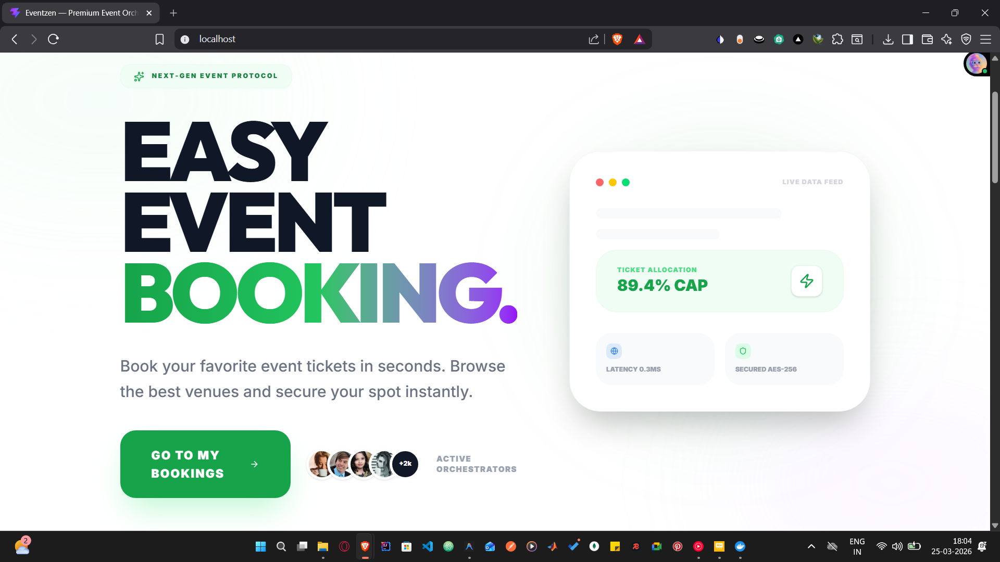

**Figure 2: Customer Dashboard**


**Figure 3: Venue Browsing**
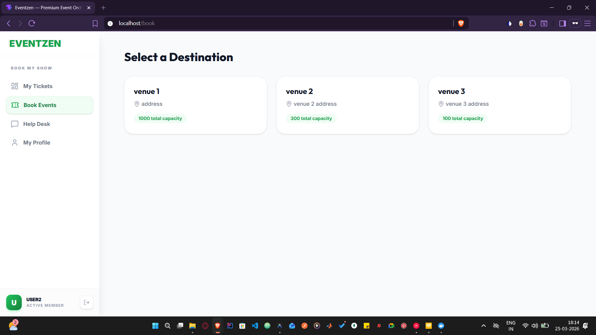

**Figure 4: Event Detail Page**
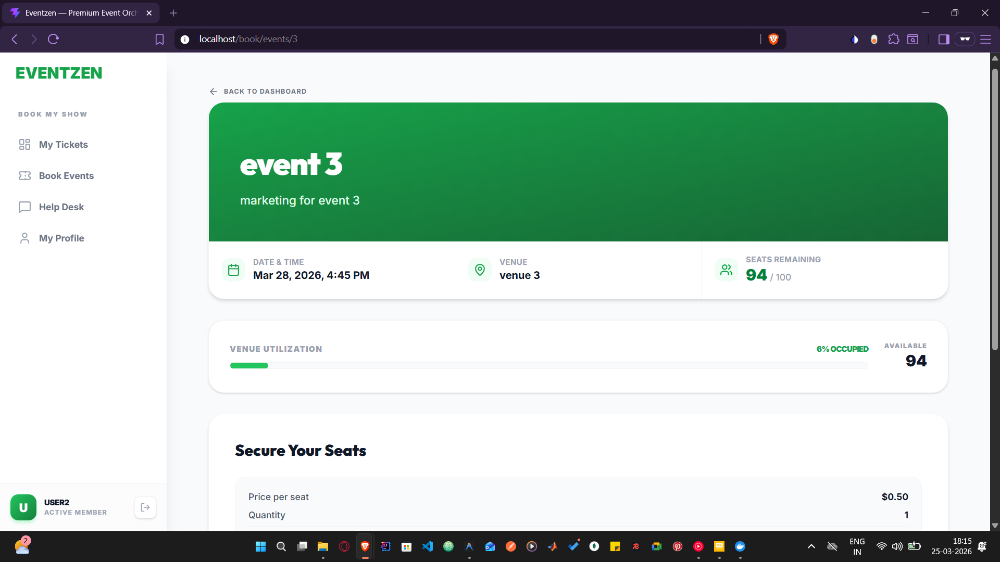

**Figure 5: Event Creation Form**
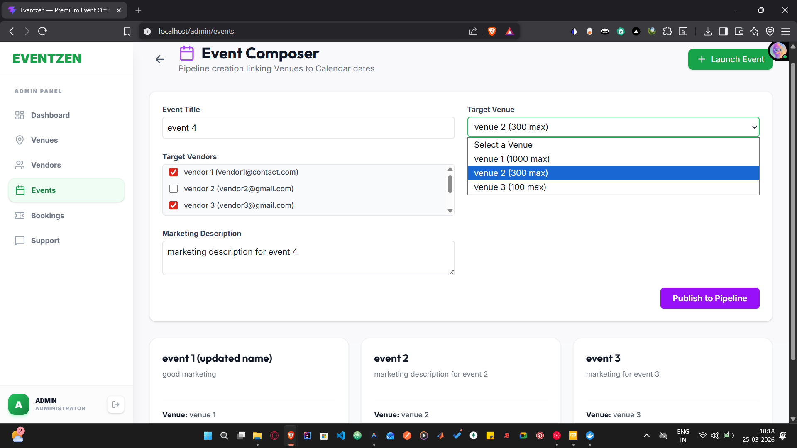

**Figure 6: Booking Approval Queue (Admin)**
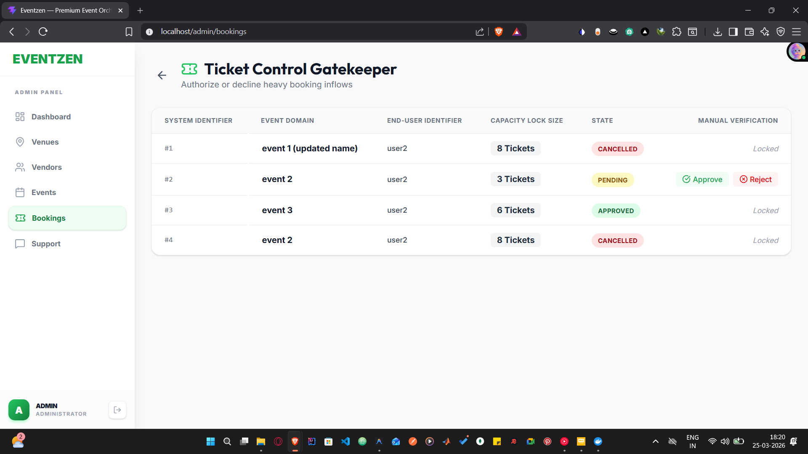

**Figure 7: Admin Dashboard**
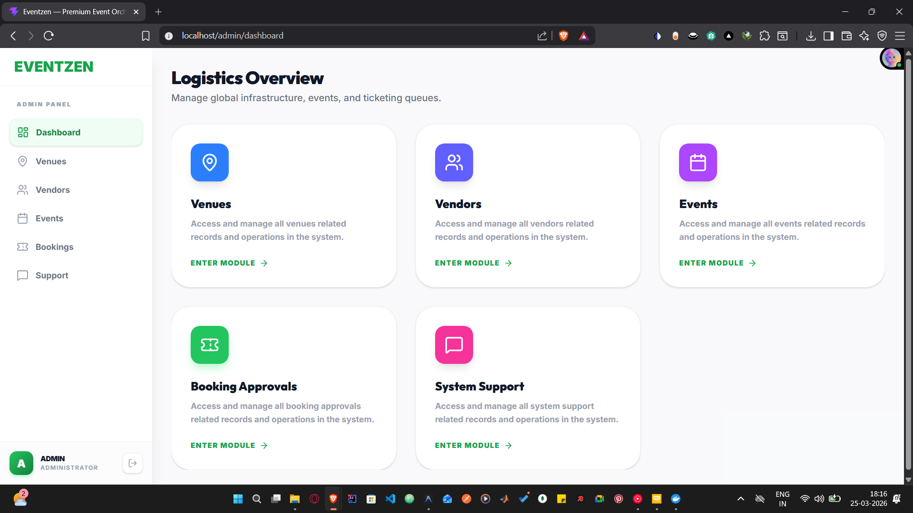

**Figure 8: Vendor Assignment / De-Assignment**
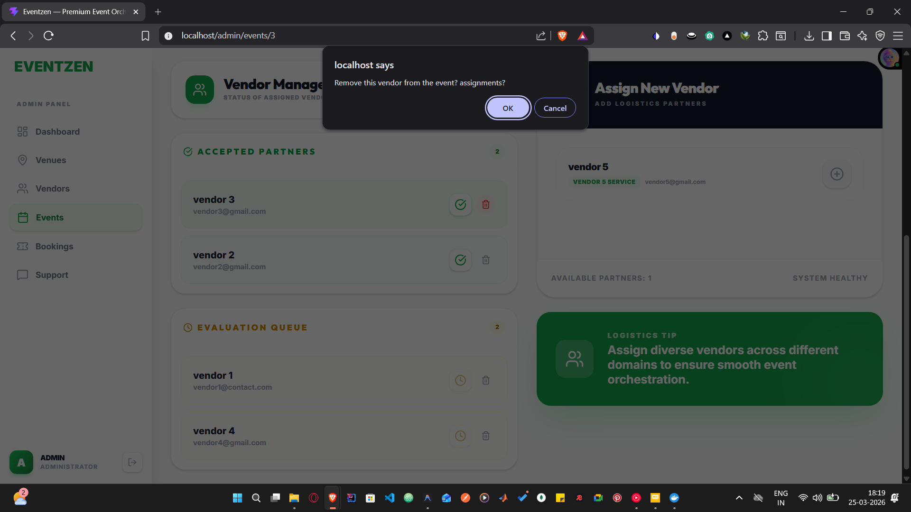

**Figure 9: Vendor Logistics**
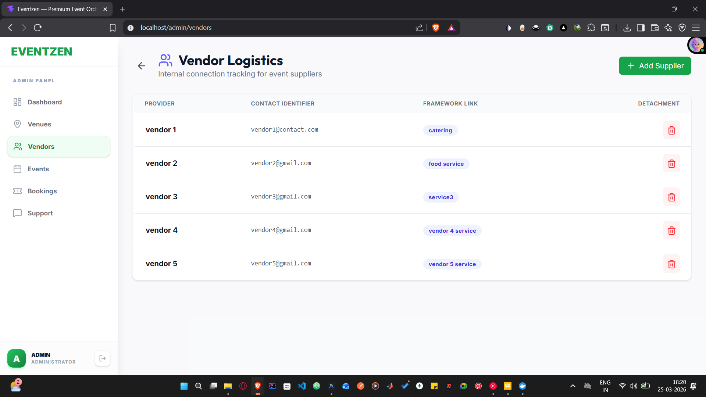

**Figure 10: Venue Management (Admin)**
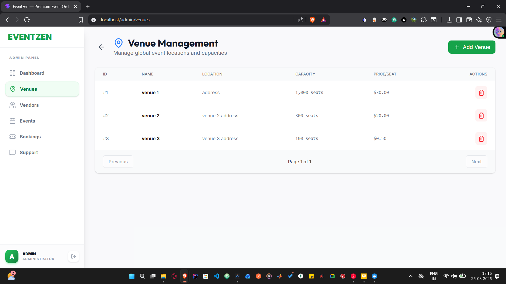

**Figure 11: Customer Help Desk (Ticket Creation)**
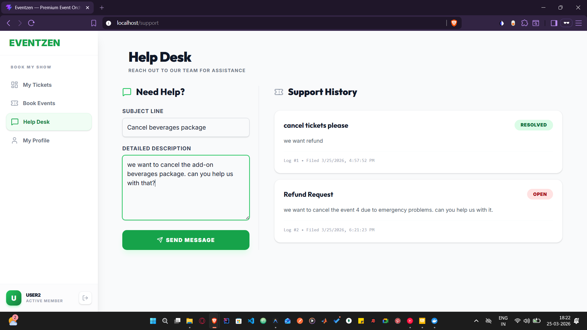

**Figure 12: Admin Support Portal (Ticket Queue)**
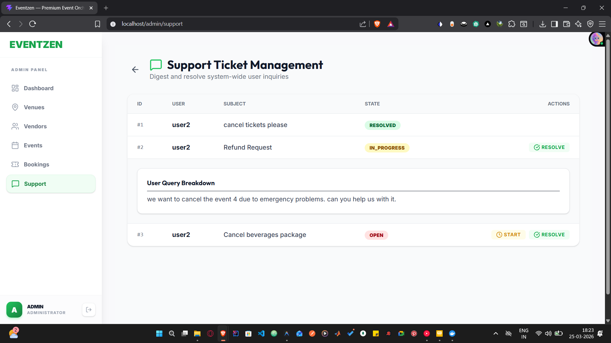

**Figure 13: Event Vendor Details (Ticket Detail / Resolution View)**
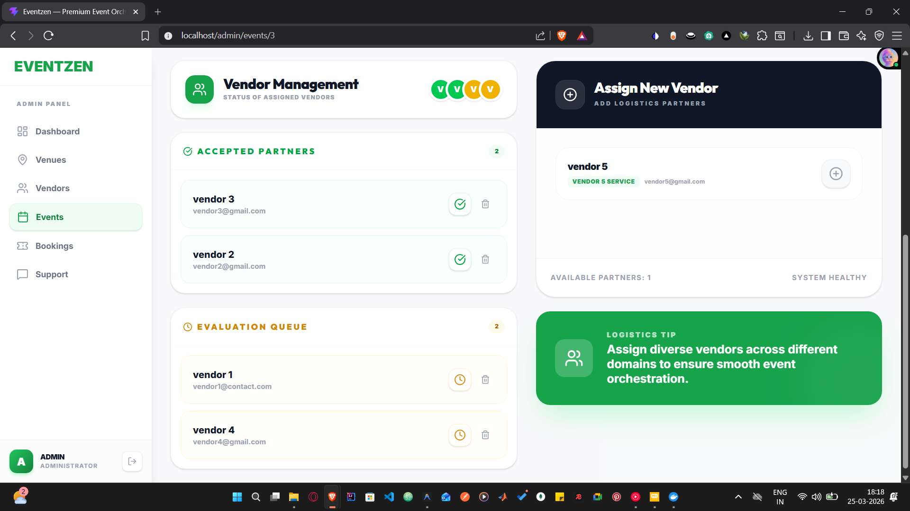

## 🐳 Deployment Proof

**Figure 14: Docker Dashboard (All Containers Running)**
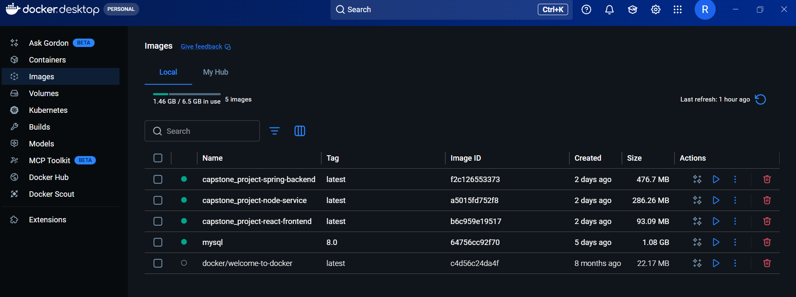

**Figure 15: Terminal Output - Spring Boot Startup**
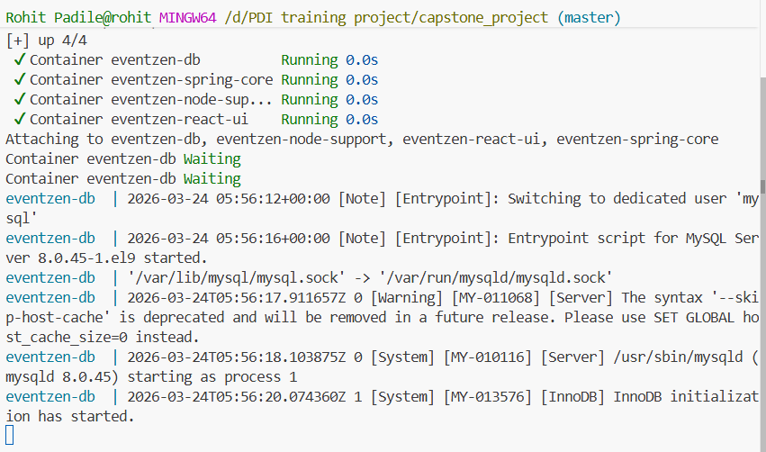

**Figure 16: Terminal Output - Node Service Running**
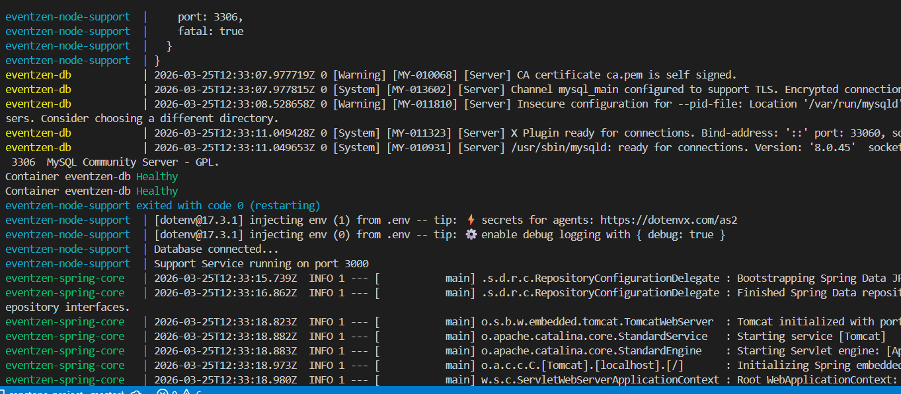

**Figure 17: Terminal Output - Additional Logs**
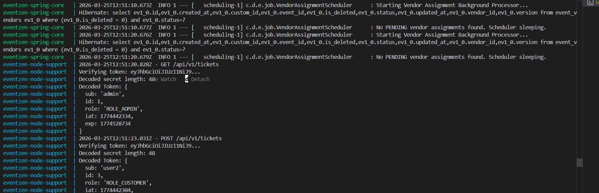