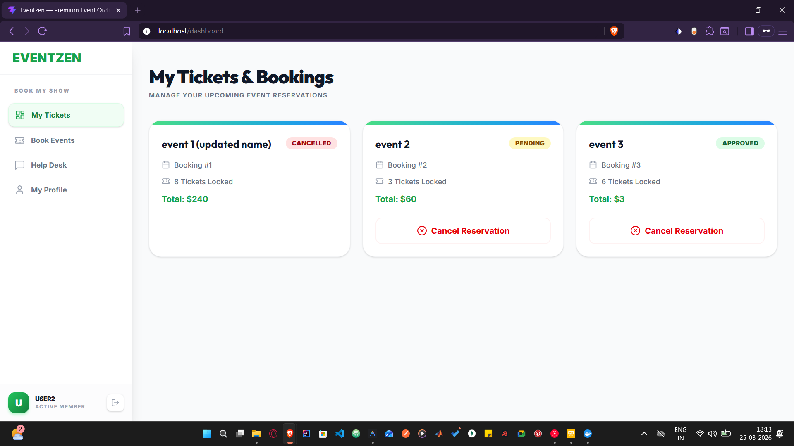

# EventZen — Enterprise Event Management Platform

**EventZen** is a professional-grade, full-stack event management system designed to streamline venue logistics, event orchestration, ticket booking, and customer support. 

Built with a hybrid monolithic/microservice architecture, it offers dedicated portals for **Administrators** to manage infrastructure and **Customers** to discover and book events.

## 🚀 Key Features

- **Venue & Vendor Management**: Admins can manage physical locations and service providers.
- **Approval-Gated Booking**: Real-time capacity management with administrative oversight.
- **Isolated Support Microservice**: Dedicated Node.js service for customer help desk operations.
- **Stateless Authentication**: Shared JWT-based security across the entire ecosystem.
- **Containerized Deployment**: One-command setup using Docker Compose.

---

## 🛠️ Technology Stack

- **Frontend**: React (Vite), TailwindCSS, React Router v6
- **Core Backend**: Java, Spring Boot, Spring Security (JWT), Hibernate/JPA
- **Support Service**: Node.js, Express, Sequelize
- **Database**: MySQL 8.0 (Shared Relational Persistence)
- **Infrastructure**: Docker & Docker Compose

---

## 📊 Database Design (ERD)

The system follows a normalized relational schema with centralized auditing and soft-deletion support.


---

## 🖼️ Application Screenshots

### 🏠 Landing Page
Welcome screen for new and returning users.


### 👤 Customer Dashboard
Manage bookings and discover upcoming events.


### 🎟️ Event Details & Booking
Select events at various venues and book seats instantly.


### 🛠️ Admin Dashboard
Complete operational control overvenues and events.


### 📋 Booking Approval Queue
Admins reviewing and approving seat reservations.


### 📝 Event Creation Form
Dynamic form for creating and configuring new events.


### 🎧 Customer Help Desk
Dedicated support portal backed by an independent microservice.


---

## 🐳 Quick Start with Docker

To launch the entire platform (Database, Spring Boot, Node.js, and React UI):

```bash
docker-compose up --build
```

Access the application at `http://localhost`.
