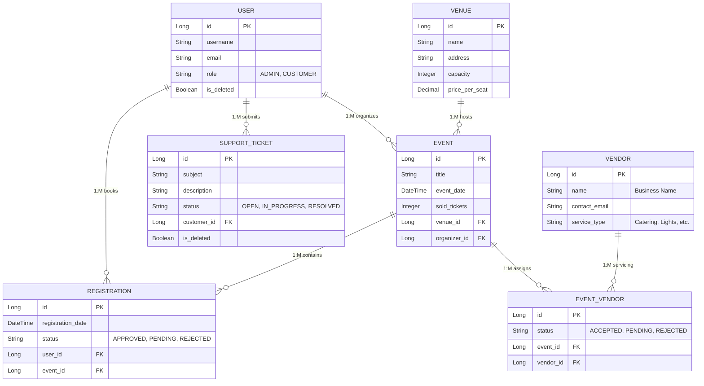

# Eventzen - Entity Relationship Diagrams (ERD)

This document visualizes the core database relational structure of the Eventzen application using Mermaid.js.

### Architectural Breakdown
- **User Roles**: The system differentiates between `ADMIN` (organizers) and `CUSTOMER` (bookers).
- **Logistics Framework**: The `EVENT_VENDOR` table acts as a join entity between `EVENT` and `VENDOR`, allowing a many-to-many relationship with a status tracker for each assignment.
- **Venue Hosting**: Each `EVENT` is bound to exactly one `VENUE`, while a `VENUE` can host many events.
- **Booking Flow**: `REGISTRATION` links `USER` to `EVENT` for ticket management.
